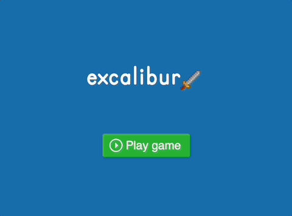

# Excalibur Platform Game in Javascript

This is an experiment to work with object oriented programming in vanilla javascript, to create an excalibur platform game.

- Uses es6 modules and classes
- Physics engine
- Switch between scenes
- Keyboard controls
- Parralax background
- Camera follows player
- Sound
- Loads JSON to build the platform level

## Install

- Download or clone this repository.
- Open `index.html` in a localhost or live server!

## Todo

- UI can be HTML, CSS instead of painstakingly creating text fields and buttons with states, in a canvas.